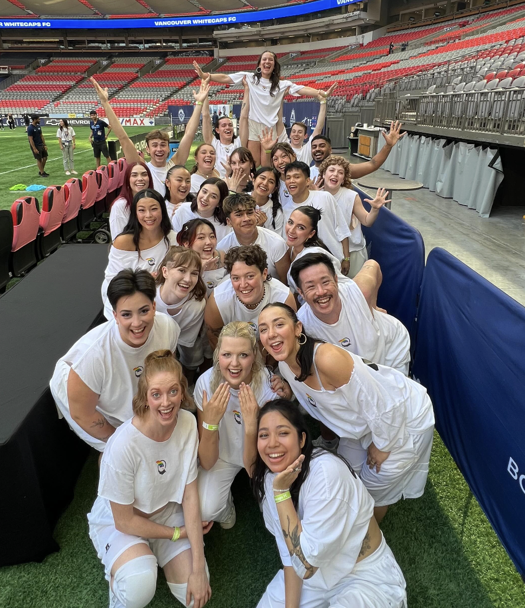
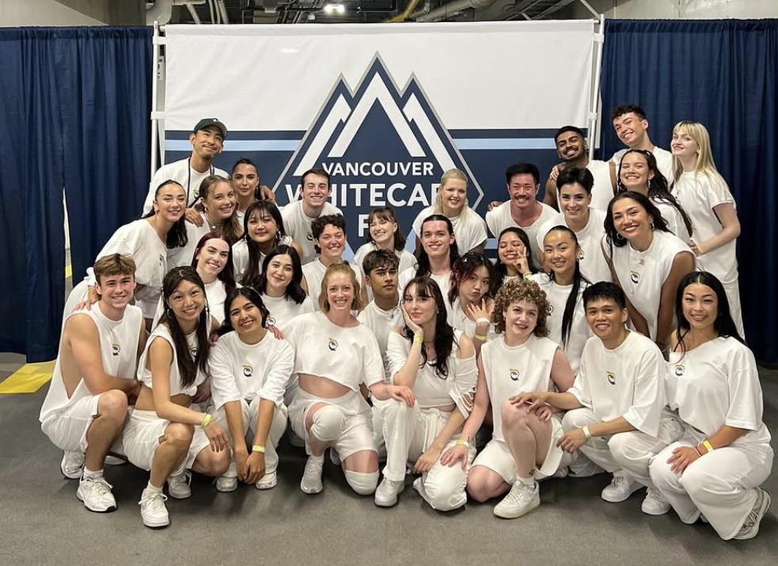
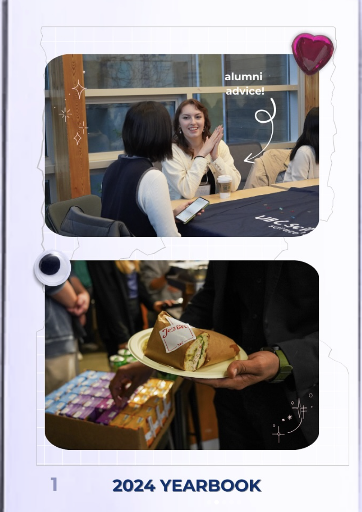
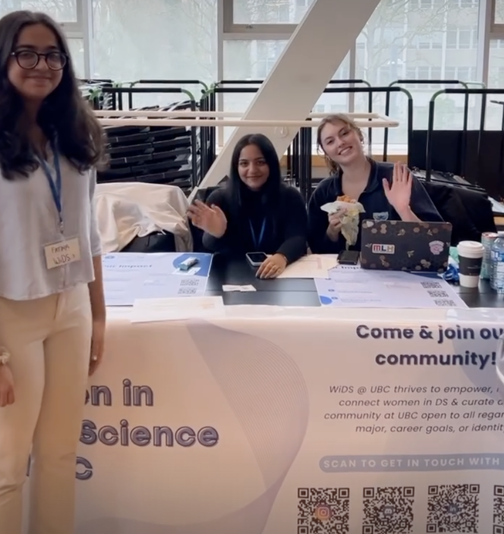

When I'm not wrangling data or tuning models, here's where you can find me :)

---

## Dance {.mt-4}

For three years, I've held executive creative roles across **UBC Dance Horizons** and **UBC Unlimited Dance**, leading event production, performance planning, and social media design. Beyond creative direction, I actively perform with a local dance team, taking the stage at Vancouver Whitecaps halftime shows, collaborating with local artists, and performing across the Pride Festival circuit. Whether I'm organizing a large scale production or performing for thousands, dance is where I channel my creativity.

::: {.grid}
::: {.g-col-12 .g-col-md-6}
{width=100%}
:::
::: {.g-col-12 .g-col-md-6}
{width=100%}
:::
:::

---

## Creative & Community {.mt-4}

From arts to civic engagement, I bring the same energy to communities beyond data science. From acting as Provincial Page at the Ontario Legislature, to WiDS Events Director, to Social Student Representative for the UBC MDS program, I believe in building bridges between technical work and the people it serves.

During my time in UBC WiDS I proposed and led the organization of an annual alumni mentorship event: Alumnight. I also helped organize the premier instance of YouCode (sponsored by Arc'teryx), one of UBC's largest hackathons. Fun fact, I also led a dance workshop during the event itself! 

::: {.grid}
::: {.g-col-12 .g-col-md-6}
{width=100%}
:::
::: {.g-col-12 .g-col-md-6}
{width=100%}
:::
:::

---

## Off the Clock {.mt-4}

- **Currently reading:** The Spellbook of Listen Taylor
- **Currently learning:** Relearning cello after a loooong hiatus
- **Fun fact:** I will randomly bake something and bring it to class/work for people to give me their opinions!

