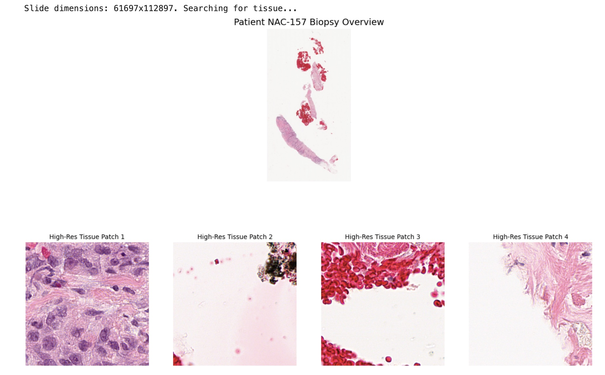
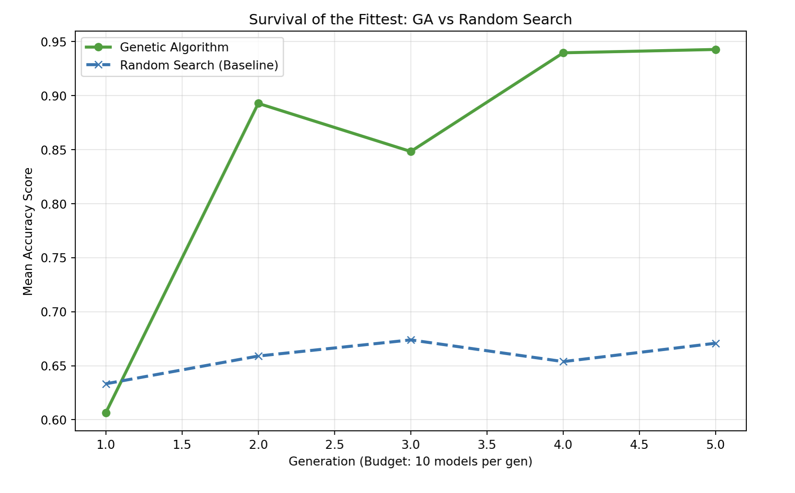
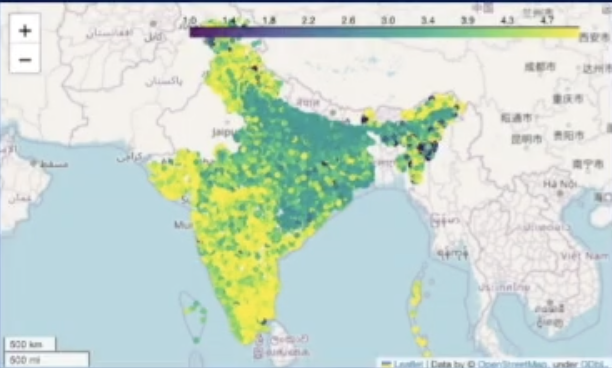
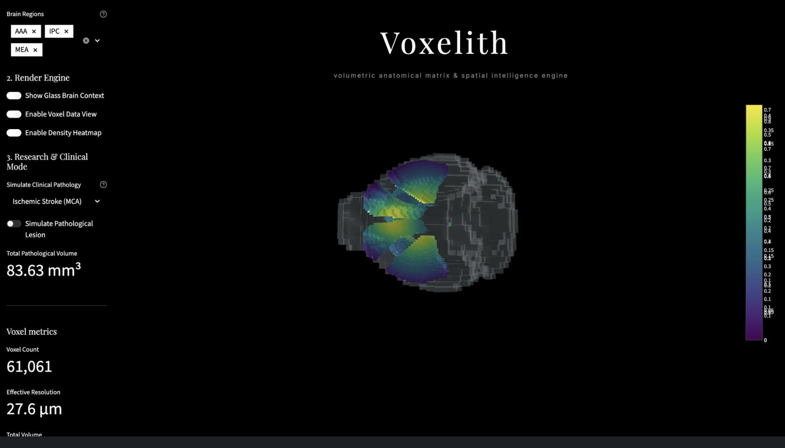

::: {#profile-section}
Hello, 

# Welcome to my Portfolio! {.profile-name}

::: {.btn_container}
[Get To Know More](#about-section){.btn_color}
:::
:::

---

::: {#about-section}
::: {.section-label}
Get To Know More
:::

# About Me {.section-title}

::: {.profile-photo-container}

:::

::: {.text_container}
My path to data science was a bit unconventional; it started in Behavioural Neuroscience. Making the leap from studying the brain to pursuing my Master's in Data Science felt like a completely natural evolution. I’ve always been driven by a need to dissect complex problems, and this field gives me the actual tools to build the solutions.

What I love most about data science is that it refuses to let you stagnate; the dynamic challenges demand constant learning and adaptation. I approach my technical work with a highly interdisciplinary mindset. Thanks to my 2+ years managing population health data at Population Data BC, my analytical skills are deeply rooted in research ethics, data policy, and rigorous statistical methodology. I am also an eager student and flexible across many domains and disciplines, due to my rich and diverse educational/work backgrounds.

But I know the best problem solving often happens when you step away from the screen. Whether I’m staying involved with my alma mater club community: UBC Women in Data Science (WiDS), or performing with my dance team, staying connected to my creative and leadership pursuits is exactly what keeps me energized for the next coding sprint.
:::
:::

---

::: {#proficiencies-section}
::: {.section-label}
Here Are My
:::

# Proficiencies {.section-title}

::: {.proficiencies-intro}
My approach to data science is inherently interdisciplinary. I ground technical building deep learning pipelines in TensorFlow/Keras and robust algorithms in Python/R, in the rigorous context of neuroscience research and population health data. I build end-to-end solutions focused on real-world impact, pairing hard technical skills with the project management, creative problem-solving, and dynamic leadership required to drive complex technical projects from abstract concept to successful deployment.
:::

::: {.article_container}

::: {.proficiency-card}
::: {.proficiency-icon}
<i class="bi bi-robot"></i>
:::
### Machine Learning & Computer Vision
Architect and train advanced predictive models, moving beyond standard tabular data to build multimodal deep learning pipelines. Proficient in leveraging frameworks like PyTorch and TensorFlow/Keras to solve complex, high-dimensional problems.
:::

::: {.proficiency-card}
::: {.proficiency-icon}
<i class="bi bi-clipboard-data"></i>
:::
### Health Data & Statistical Methodology
Grounded in behavioral neuroscience and 2+ years managing population health data. I design rigorous, bias-aware data pipelines backed by strong statistical methodology, research ethics, and an understanding of domain-specific constraints.
:::

::: {.proficiency-card}
::: {.proficiency-icon}
<i class="bi bi-bar-chart-line"></i>
:::
### Interactive Data Visualization
Transform complex datasets and model outputs into intuitive, interactive tools. From building dynamic Streamlit applications to designing comprehensive dashboards, I make high-level algorithmic outputs actionable for stakeholders.
:::

::: {.proficiency-card}
::: {.proficiency-icon}
<i class="bi bi-journal-text"></i>
:::
### Technical Communication & Reproducibility
Translate intricate architectures into clear, reproducible documentation and tutorials. Drawing from my experience as a Teaching Fellow, I ensure complex data concepts and codebases are accessible to both technical and non-technical audiences.
:::

::: {.proficiency-card}
::: {.proficiency-icon}
<i class="bi bi-diagram-3"></i>
:::
### Technical Leadership & Project Management
Bridge the gap between technical execution and project strategy. With experience directing hackathon teams, community events, and health technology implementation, I drive collaborative solutions from abstract concept to successful deployment.
:::
:::
:::

---

::: {#projects-section}
::: {.section-label}
Browse Through My
:::

# Projects {.section-title}

::: {.details_container}
::: {.project-card}
::: {.project-card-image}

:::
### Multimodal pCR Prediction for Breast Cancer · **National Canadian Medical Datathon, 3rd Place**

Predicts pCR in breast cancer post-chemotherapy. OpenCV extracts spatial biomarkers from Whole Slide Images; Keras neural network fuses pathology + clinical data. 78% accuracy, 92% precision.

*Python · OpenCV · Keras · Project Management*

[View Project →](https://github.com/farkasvic/National_Canadian_Medical_Datathon_2026){.project-link}
:::
::: {.project-card}
::: {.project-card-image}

:::
### Survival of the Fittest (Model) · **Quarto Blog Tutorial**

Evolve hyperparameters with genetic algorithms. A Hands on tutorial: GA vs Random Search on a Random Forest classifier.

*Quarto · Python · scikit-learn*

[View Project →](https://farkasvic.quarto.pub/survival-of-the-fittest-%28model-optimizing-with-genetic-algorithms/%29){.project-link}
:::

::: {.project-card}
::: {.project-card-image}

:::
### NepTune · **Pacific Conference on AI, 1st Place**

1st-place ML model predicting regional water quality from geospatial survey data and satellite image features.

*Python · Geospatial · Business Implementation*

[View Projects](projects.qmd){.project-link}
:::

::: {.project-card}
::: {.project-card-image}

:::
### Voxelith · **Cursor AI Hackathon**

3D brain visualization engine. Allen Atlas, voxelization, pathology simulation (stroke, glioblastoma), lesion mode, density heatmaps.

*Python · Streamlit · Plotly · PyVista*

[View Project →](https://github.com/farkasvic/voxelith){.project-link}
:::
:::

[View all projects →](projects.qmd){.btn_color .mt-3}
:::

---

::: {#platforms-section}
::: {.section-label}
Explore My
:::

# Other Platforms {.section-title}

::: {.platforms_container}
::: {.platform-card}
::: {.platform-icon}
<i class="bi bi-linkedin"></i>
:::
### [LinkedIn](https://linkedin.com/in/victoria-farkas-617262262)

:::

::: {.platform-card}
::: {.platform-icon}
<i class="bi bi-journal-code"></i>
:::
### [Quarto Pub](https://farkasvic.quarto.pub/)

:::

::: {.platform-card}
::: {.platform-icon}
<i class="bi bi-github"></i>
:::
### [GitHub](https://github.com/farkasvic)
:::
:::
:::

---

::: {#contact-section}
::: {.section-label}
Reach Out
:::

# Contact Me {.section-title}

::: {.contact-container}
::: {.contact-info}
## Contact Information

**Victoria Farkas**

Vancouver, BC

[victoriafarkas9@gmail.com](mailto:victoriafarkas9@gmail.com)

[LinkedIn](https://linkedin.com/in/victoria-farkas-617262262)
:::
:::
:::
